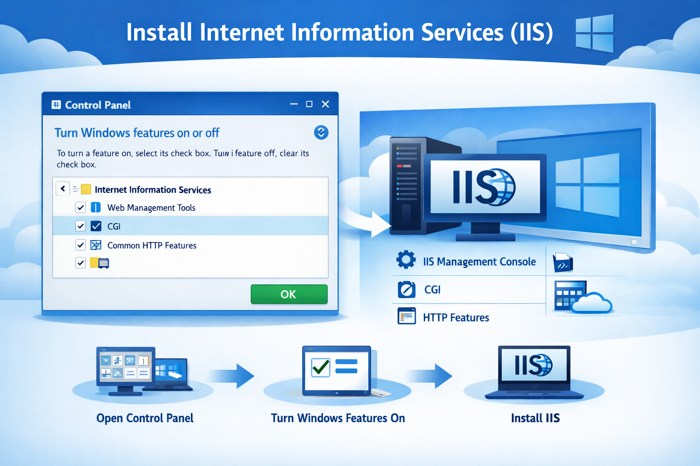
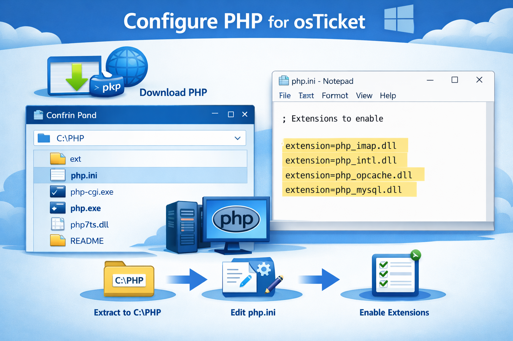
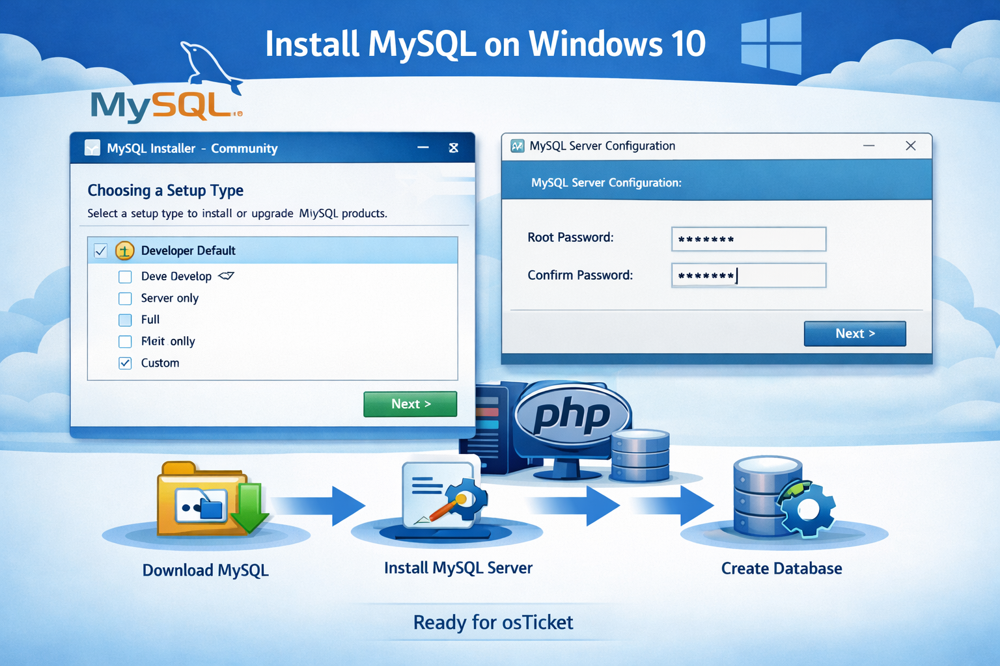
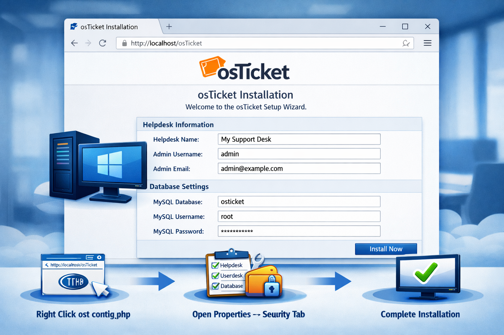
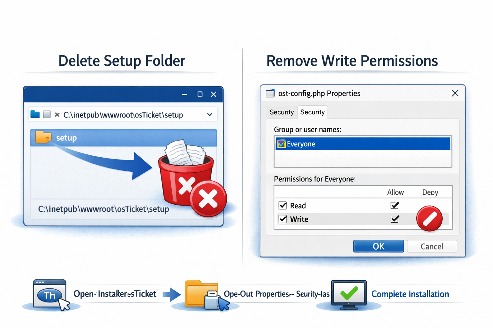

  

# osTicket — Prerequisites and Installation  
*A simple, beginner‑friendly walkthrough with screenshots*

This guide shows you how to install the open‑source help desk system **osTicket** on a Windows 10 Virtual Machine in Microsoft Azure.  
You will install all required software, configure IIS, set up PHP, create a database, and finish the osTicket installation.

---

# 🧰 Technologies Used
- Microsoft Azure (Virtual Machines)
- Remote Desktop (RDP)
- Internet Information Services (IIS)
- PHP + required extensions
- MySQL Server
- osTicket Installer

---

# 🖥 Operating System Used
- **Windows 10 (21H2)**

---

# 🟦 Part 1 — Create Your Azure Virtual Machine

## ✔️ 1. Create a Windows 10 VM in Azure
- Go to https://portal.azure.com  
- Create a **Resource Group**
- Create a **Windows 10 VM**
- Allow Azure to create:
  - A **Virtual Network (VNet)**
  - A **Subnet**
- Connect to the VM using **Remote Desktop**

  

---

# 🟩 Part 2 — Install Required Software

## ✔️ 2. Install IIS (Internet Information Services)

### Steps:
1. Open **Control Panel**
2. Go to **Programs → Turn Windows features on or off**
3. Enable:
   - Internet Information Services
   - IIS Management Console
   - CGI
   - Common HTTP Features
4. Click **OK** and let Windows install IIS

  

---

## ✔️ 3. Install PHP and Required Extensions

### Steps:
1. Download PHP (version 7.3 or 7.4 works best with osTicket 1.15.x)
2. Extract PHP to: C:\PHP
3. Open `php.ini` and enable these extensions:
- php_imap.dll  
- php_intl.dll  
- php_opcache.dll  
- php_mysql.dll  

---

## ✔️ 4. Install MySQL Server

### Steps:
1. Download **MySQL Community Server**
2. Choose **Developer Default**
3. Set a root password
4. Create a database for osTicket: CREATE DATABASE osticket;

---

## ✔️ 5. Configure IIS to Use PHP

### Steps:
1. Open **IIS Manager**
2. Click your server name
3. Open **Handler Mappings**
4. Add a new module mapping:
- Request path: `*.php`
- Module: **FastCgiModule**
- Executable: `C:\PHP\php-cgi.exe`
- Name: **PHP via FastCGI**
5. Restart IIS

---

# 🟧 Part 3 — Install osTicket

## ✔️ 6. Download and Extract osTicket

### Steps:
1. Download osTicket from https://osticket.com/download
2. Extract the ZIP file
3. Copy the **upload** folder to: C:\inetpub\wwwroot\osTicket
4. Rename: ost-sampleconfig.php → ost-config.php

---

## ✔️ 7. Set File Permissions

### Steps:
1. Right‑click `ost-config.php`
2. Go to **Properties → Security**
3. Give **Everyone**:
- Read
- Write

---

## ✔️ 8. Run the osTicket Installer

### Steps:
1. Open your browser and go to: http://localhost/osTicket
2. Fill out:
- Helpdesk name
- Admin username
- Admin email
3. Enter your MySQL database info:
- Database: `osticket`
- Username: `root` (or your DB user)
- Password: your MySQL password

---

# 🟩 Part 4 — Final Cleanup

## ✔️ 9. Secure Your Installation

### Steps:
1. Delete the **setup** folder: C:\inetpub\wwwroot\osTicket\setup
2. Remove write permissions from: ost-config.php

---

# 🎉 Installation Complete!

You now have a fully working osTicket help desk system running on your Azure VM.

---

# 📌 Optional Add‑Ons
- Email piping  
- SMTP configuration  
- SSL certificate  
- Custom themes  
- Agent/admin training  

---
